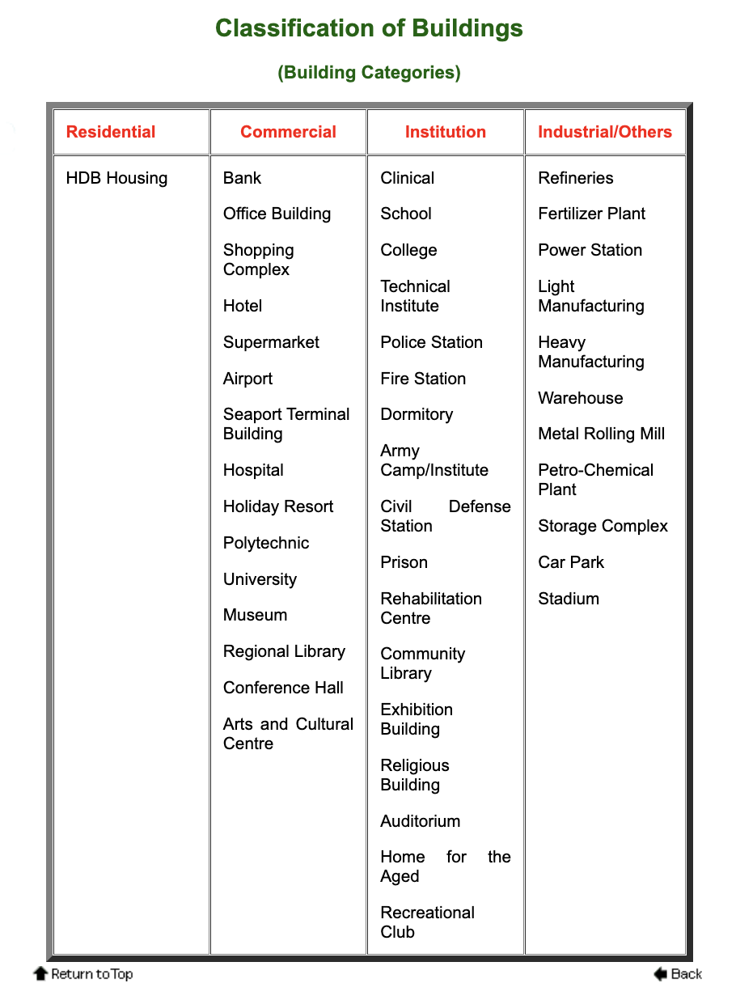

# Capstone: Predicting Building's EUI

## Introduction

In this project, we aim to create a model to predict a building's EUI using its buidling characteristics as well as the weather data for the location of the building

## Problem Statement

Green financing activity, which refers to loans aimed at advancing environmental sustainability, is gaining traction not just in [Singapore](https://www.straitstimes.com/business/companies-markets/green-financing-activity-in-spore-on-the-rise-uptrend-set-to-continue) but also around the world as institutions and building owners look to play their part in the fight against climate change through promoting a green economic transformation towards low-carbon, sustainable and inclusive pathways. 

There are, however, challenges faced by banks/institutions. At present, the lack of disclosure of environmental, social and governance (ESG) data by many corporations creates asymmetric information. Furthermore, the 'greenness' of a financial instrument is not obvious, and there is often a lack of standard criteria to judge which assets and investments are green. [Source: Accenture](https://bankingblog.accenture.com/sustainable-finance-starts-with-data-and-technology)

To address these challenges, in 2021, a financial industry taskforce convened by the Monetary Authority of Singapore (MAS) studied and launched several initiatives to accelerate Green Finance in Singapore through improving disclosures and fostering green solutions. [Source: MAS](https://www.mas.gov.sg/news/media-releases/2021/accelerating-green-finance)

EUI, which stands for Energy Use Intensity, is an indicator of the energy efficiency of a building's design and/or operations. It is calculated by dividing the total energy consumed by the building in one year by the total gross floor area of the building. Thus, it can be used as an index for building owners and facilities managers to compare their building's annual energy performance against similar building types, and is also used as a scoring metric by BCA (The Building and Construction Authority) of Singapore to determine the "greenness" of a building. Banks could also use this as reference to compare how "green" or energy efficient a building is, and gauge the potential for the upgradation of eco-friendly measures.

Thus, for this project, **we aim to answer if we can build a model to predict a builing's EUI using its building characteristics as well as weather data for the location of the building.**

The stakeholders are **banks, policymakers and even companies that are working on benchmarking/ helping prospective clients understand how their energy consumption matches up with others in a similar industry**

At the end, we also aim to apply our findings to the context of Singapore, and explore how we can make our model work better there.

## Data Dictionary

Data is taken from the Kaggle competition WiDS Datathon 2022

|Feature|Type|Dataset|Description|
|---|---|---|---|
|Year_Factor|int|train & test|anonymized year in which the weather and energy usage factors were observed| 
|State_Factor|int|train & test|anonymized state in which the building is located| 
|building_class|object|train & test|building classification| 
|facility_type|object|train & test|building usage type|
|floor_area|float|train & test|floor area (in square feet) of the building|
|year_built|int|train & test|year in which the building was constructed|
|energy_star_rating|int|train & test|the energy star rating of the building|
|ELEVATION|int|train & test|elevation of the building location|
|january_min_temp|float|train & test|minimum temperature in January (in Fahrenheit) at the location of the building|
|january_avg_temp|float|train & test|average temperature in January (in Fahrenheit) at the location of the building|
|january_max_temp|float|train & test|maximum temperature in January (in Fahrenheit) at the location of the building|
|february_min_temp|float|train & test|minimum temperature in February (in Fahrenheit) at the location of the building|
|february_avg_temp|float|train & test|average temperature in February (in Fahrenheit) at the location of the building|
|february_max_temp|float|train & test|maximum temperature in February (in Fahrenheit) at the location of the building|
|march_min_temp|float|train & test|minimum temperature in March (in Fahrenheit) at the location of the building|
|march_avg_temp|float|train & test|average temperature in March (in Fahrenheit) at the location of the building|
|march_max_temp|float|train & test|maximum temperature in March (in Fahrenheit) at the location of the building|
|april_min_temp|float|train & test|minimum temperature in April (in Fahrenheit) at the location of the building|
|april_avg_temp|float|train & test|average temperature in April (in Fahrenheit) at the location of the building|
|april_max_temp|float|train & test|maximum temperature in April (in Fahrenheit) at the location of the building|
|may_min_temp|float|train & test|minimum temperature in May (in Fahrenheit) at the location of the building|
|may_avg_temp|float|train & test|average temperature in May (in Fahrenheit) at the location of the building|
|may_max_temp|float|train & test|maximum temperature in May (in Fahrenheit) at the location of the building|
|june_min_temp|float|train & test|minimum temperature in June (in Fahrenheit) at the location of the building|
|june_avg_temp|float|train & test|average temperature in June (in Fahrenheit) at the location of the building|
|june_max_temp|float|train & test|maximum temperature in June (in Fahrenheit) at the location of the building|
|july_min_temp|float|train & test|minimum temperature in July (in Fahrenheit) at the location of the building|
|july_avg_temp|float|train & test|average temperature in July (in Fahrenheit) at the location of the building|
|july_max_temp|float|train & test|maximum temperature in July (in Fahrenheit) at the location of the building|
|august_min_temp|float|train & test|minimum temperature in August (in Fahrenheit) at the location of the building|
|august_avg_temp|float|train & test|average temperature in August (in Fahrenheit) at the location of the building|
|august_max_temp|float|train & test|maximum temperature in August (in Fahrenheit) at the location of the building|
|september_min_temp|float|train & test|minimum temperature in September (in Fahrenheit) at the location of the building|
|september_avg_temp|float|train & test|average temperature in September (in Fahrenheit) at the location of the building|
|september_max_temp|float|train & test|maximum temperature in September (in Fahrenheit) at the location of the building|
|october_min_temp|float|train & test|minimum temperature in October (in Fahrenheit) at the location of the building|
|october_avg_temp|float|train & test|average temperature in October (in Fahrenheit) at the location of the building|
|october_max_temp|float|train & test|maximum temperature in October (in Fahrenheit) at the location of the building|
|november_min_temp|float|train & test|minimum temperature in November (in Fahrenheit) at the location of the building|
|november_avg_temp|float|train & test|average temperature in November (in Fahrenheit) at the location of the building|
|november_max_temp|float|train & test|maximum temperature in November (in Fahrenheit) at the location of the building|
|december_min_temp|float|train & test|minimum temperature in December (in Fahrenheit) at the location of the building|
|december_avg_temp|float|train & test|average temperature in December (in Fahrenheit) at the location of the building|
|december_max_temp|float|train & test|maximum temperature in December (in Fahrenheit) at the location of the building|
|cooling_degree_days|float|train & test|cooling degree day for a given day is the number of degress where the daily average temperature exceeds 65 degrees Fahrenheit. Each month is summed to produce an annual total at the location of the building|
|heating_degree_days|float|train & test|heating degree day for a given day is the number of degress where the daily average temperature falls under 65 degrees Fahrenheit. Each month is summed to produce an annual total at the location of the building|
|precipitation_inches|float|train & test|annual precipitation in inches at the location of the building|
|snowfall_inches|float|train & test|annual snowfall in inches at the location of the building|
|snowdepth_inches|float|train & test|annual snow depth in inches at the location of the building|
|avg_temp|float|train & test|average temperature over a year at the location of the building|
|days_below_30F|int|train & test|total number of days below 30 degrees Fahrenheit at the location of the building|
|days_below_20F|int|train & test|total number of days below 20 degrees Fahrenheit at the location of the building|
|days_below_10F|int|train & test|total number of days below 10 degrees Fahrenheit at the location of the building|
|days_below_0F|int|train & test|total number of days below 0 degrees Fahrenheit at the location of the building|
|days_below_80F|int|train & test|total number of days below 80 degrees Fahrenheit at the location of the building|
|days_below_90F|int|train & test|total number of days below 90 degrees Fahrenheit at the location of the building|
|days_below_100F|int|train & test|total number of days below 100 degrees Fahrenheit at the location of the building|
|days_below_110F|int|train & test|total number of days below 110 degrees Fahrenheit at the location of the building|
|direction_max_wind_speed|int|train & test|wind direction for peak wind gust speed at the location of the building. Given in 360-degree compass point directions (e.g. 360 = north, 180 = south, etc.)
|max_wind_speed|int|train & test|maximum wind speed at the location of the building
|days_with_fog|int|train & test|number of days with fog at the location of the building|

## Outline

* **Section 1: Problem Statement**
    * We define our proble statement here
* **Section 2: EDA (Exploratory Data Analysis)**
    * We perform EDA to gain insights into the dataset, from which we would use for feature engineering
* **Section 3: Feature Engineering**
    * We transform the data to prepare for modeling
* **Section 4: Modeling**
    * We run our selected models 
* **Section 5: Fine-tuning our Model**
    * We fine-tune some variables to attain better results
* **Section 6: Conclusion and Future Recommendations**
    * A summary of our findings is shared. We also explore how to apply our findings to the Singapore context

## Models Results

|s/n|Model Type|Train Score|Test Score|Cross-Validatiion Score|Train MSE|Test MSE|
|---|---|---|---|---|---|---|
|1|Linear Regression|0.441|0.412|0.436|1311.86|1487.54
|2|Ridge Regression|0.441|0.410|0.436|1311.93|1490.86
|3|Lasso Regression|0.440|0.411|0.436|1312.41|1489.60
|4|Gradient Boost|0.488|0.443|0.476|1201.89|1407.73
|5|Ada Boost|0.159|0.171|0.107|1973.76|2097.43
|6|Random Forest|0.404|0.367|0.394|1398.61|1601.84

## Model Findings

* Gradient Boost performs best
* Our linear regression models are the next best performing. They all attain similar scores. We postulate that the reason why all 3 give identical scores is because there are only a few predictors that seem very important. Thus, the penalization of the weights do not have much impact on the overall model.
* Ada Boost performs worst. Not good for regression problems.

## Conclusion

We have taken the dataset, performed EDA, did feature engineering, and ran a few models to determine which is best, and Gradient Boost is the best performing model.

Circling back to our problem statement, we want to predict a builing's EUI using its building characteristics as well as weather data for the location of the building. 

Though our scores attained are not very high, we still feel that it is a good starting point and we have learnt a couple of things that we can move forward with.

1) **Energy_Star_Rating is the strongest indicator**
    * Applying to the Singapore context, we have standards too to access whether a buidling is performing energy efficiently, which is called GreenMark Certification
    * So when building a prediction model for Singapore buildings, we can look to the GreenMark Certificaton as one of the features
    
    
2) **We can expand building_class further to add more granularity**
    * Applying to the Singapore context, BCA broadly classifies the buildings into 4 categories, which can be seen in the image attached.
    

[*image source*](https://www.bca.gov.sg/professionals/iquas/conquas_bcat.html)

3) **Cold weather causes greater variation in the EUI/ uptick in energy consumption than warm weather**
    * Applying to the Singapore context, this might not seem useful given that we experience warm weather all year round
    * However, Singapore naturally should have a high air-conditioning usage all year long. Air-conditioning energy usage can vary largely dependent on the changs in temperature, more so when it is really hot outside. Thus, we postulate that, in Singapore, the energy consumption could vary more with slight changes in temperature.
    
    
4) **Facility type is important too**
    * Different facilities have different nature of operations, which greatly affect the energy usage that they need.
    * From a personal perspective, our company is currently collecting energy data for over 50+ companies across different industries in Singapore, which cannot be scrapped from the web unlike the weather data. Thus, it is exciting for us to begin labelling these different companies by the different industries that they are us.

## Future Recommendations

* **To better measure the relationship between weather and the buildings energy performance, we should collect data on the builing's monthly energy data and daily energy usage**
    * Of course other factors would affect the energy usage such as occupancy rate, but this should still provide a good starting point
    

* **To make this dataset for robust and dynamic, we should input data for the same builings over the different years**
    * In this current dataeset, there are some builings that with only 1 data point (for either 1 of the year_factor), while others have more than 1 data point (appears in more than 1 year_factor)
    * This way, we can more accurately model the effects of the weather on the builings, since the weather would fluctuate/ differ slightly over the different years
    
    
* **Different facilities have different operating conditions and energy needs. It will be more valuable and insightful for our stakeholders if we compare and benchmark the buildings according to the type of industry that they are in.**
    * In this way, our stakeholders can make a more informed decision on whether to commision retrofitting efforts to maximize carbon emissions, issue green loans etc.

* **We can begin to expand our database and build prediction models for buildings residing in different climates.**
    * In other climates such as that of Singapore, there is little to none heating appliances since there is no cold weather experienced there. As such, the energy consumption can differ quite a bit. The features used for the model might be quite different too.
    
    
* **Include other features such as building coating materials, when the building was last upgraded with new energy saving equipment etc.**
    * From our findings, the age of the buidling does not have a distinctive relationship with the site_eui. It will be more insightful to include if and when the building was upgraded with new equipment as it paints a more accurate picture.
    * From a stakeholder perspective, it also provides more clarity if the building is still worth investing or not.

## Our model's value proposition

We have learned the above lessons, and we are confident that we can apply what we learn to developing a model for one in Singapore. What is, then, the value for banks, institutions etc. as mentioned in the problem statement. Moreover, it might also seem that, we can just use the rating system, i.e., energy star rating, to make an assessment on a site's "green potential"

Our model's value is that, by predicting a building's eui, we can immediately access and estimate the amount of cost savings that we can attain by investing in eco-friendly measures.

**EUI = Annual Energy Consumption (kWh) / Gross Floor Area (ft2)**

If say, we predict a building's EUI to be 120, and we know the median or average EUI for such buidlings in similar industries is 70. We can immediately take the delta, which is 50, and multiply that builing's gross floor area. This would then give us the estimated annual energy consumption that they could save. We could then use this information to engage with them, instead of them needing to give us their energy consumption bills in the first place, which can be quite sensitive.

